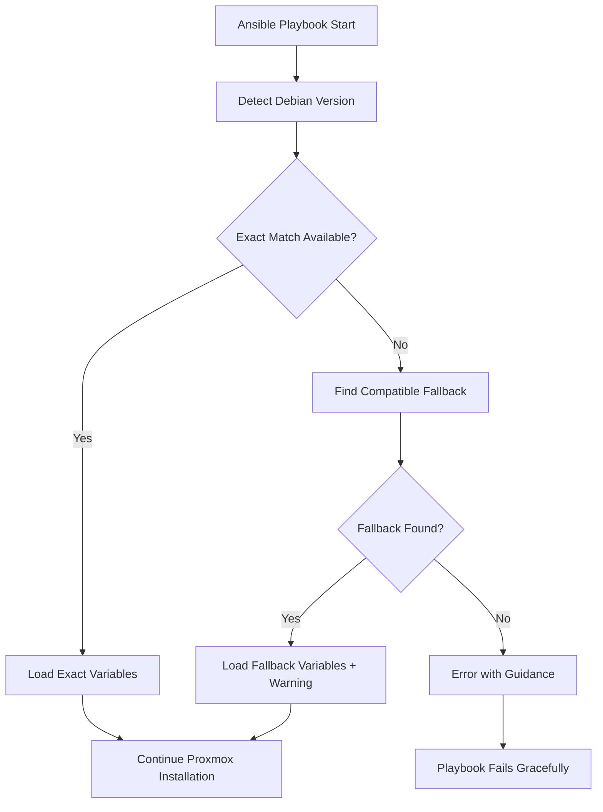

# Design Document

## Overview

The current `lae.proxmox` role fails on Debian 13 (Trixie) because it uses a simple `include_vars` task that directly references `debian-{{ ansible_distribution_release }}.yml` without any fallback mechanism. The role currently supports Debian 10 (Buster), 11 (Bullseye), and 12 (Bookworm) but lacks support for newer versions.

This design implements a robust variable loading system that provides graceful fallbacks and easy extensibility for future Debian versions while maintaining backward compatibility.

## Architecture

The solution uses a layered approach with three main components:

1. **Version Detection Layer**: Identifies the current Debian version and maps it to supported configurations
2. **Fallback Resolution Layer**: Determines the best available configuration when exact matches aren't found  
3. **Variable Loading Layer**: Loads the appropriate variables with proper error handling and logging



## Components and Interfaces

### 1. Custom Proxmox Fix Role (`roles/proxmox_fix`)

A new Ansible role that wraps the `lae.proxmox` role and provides enhanced variable loading:

**Tasks Structure:**
- `main.yml`: Orchestrates the variable loading and delegates to lae.proxmox
- `load_variables.yml`: Implements the enhanced variable loading logic
- `validate_compatibility.yml`: Validates loaded variables work with current system

**Variables Structure:**
- `vars/debian-version-mapping.yml`: Maps Debian versions to compatible configurations
- `vars/debian-*.yml`: Version-specific variable files (copied/adapted from lae.proxmox)

### 2. Version Mapping System

A centralized mapping that defines:
- Supported Debian versions and their exact variable files
- Fallback chains for unsupported versions
- Compatibility matrices for different Proxmox/Ceph versions

### 3. Enhanced Variable Loading Logic

**Primary Loading Strategy:**
1. Attempt to load exact match: `debian-{{ ansible_distribution_release }}.yml`
2. If not found, consult version mapping for fallback
3. Load fallback variables with appropriate warnings
4. Validate critical variables are present

**Fallback Chain Example:**
- Debian 13 (Trixie) → Debian 12 (Bookworm) variables
- Debian 14 (Future) → Debian 12 (Bookworm) variables  
- Unknown versions → Latest stable (Bookworm)

## Data Models

### Version Mapping Configuration
```yaml
# vars/debian-version-mapping.yml
debian_version_support:
  exact_matches:
    - buster
    - bullseye  
    - bookworm
  
  fallback_chains:
    trixie: bookworm      # Debian 13 → 12
    sid: bookworm         # Debian unstable → 12
    
  default_fallback: bookworm
  
  compatibility_notes:
    trixie: "Using Bookworm configuration - verify Ceph compatibility"
```

### Variable File Structure
Each Debian version file contains:
```yaml
# vars/debian-bookworm.yml
pve_ssh_ciphers: "aes128-ctr,aes192-ctr,aes256-ctr,..."
pve_ceph_default_version: reef
pve_ceph_debian_component: no-subscription
```

## Error Handling

### Graceful Degradation Strategy
1. **Level 1**: Exact match found → Normal operation
2. **Level 2**: Fallback available → Warning logged, continue with fallback
3. **Level 3**: No fallback → Clear error with remediation steps

### Error Messages
- **Missing Variables**: "No configuration found for Debian {{ version }}. Supported: {{ supported_list }}"
- **Fallback Used**: "Using {{ fallback_version }} configuration for Debian {{ actual_version }}"
- **Validation Failed**: "Loaded variables failed compatibility check: {{ specific_issues }}"

### Recovery Mechanisms
- Automatic fallback to most recent stable version
- Manual override capability via `pve_force_debian_version` variable
- Validation checks before proceeding with Proxmox installation

## Testing Strategy

### Unit Testing (Molecule)
- Test variable loading for each supported Debian version
- Test fallback mechanisms with mock unsupported versions
- Test error conditions and recovery paths

### Integration Testing
- Deploy on actual Debian 11, 12, and 13 systems
- Verify Proxmox installation succeeds with fallback variables
- Test cluster formation with mixed Debian versions

### Validation Testing
- Verify SSH cipher compatibility across versions
- Test Ceph version compatibility with different Debian releases
- Validate network configuration consistency

### Test Matrix
```yaml
test_scenarios:
  - debian_version: bullseye
    expected_result: exact_match
    variables_file: debian-bullseye.yml
    
  - debian_version: bookworm  
    expected_result: exact_match
    variables_file: debian-bookworm.yml
    
  - debian_version: trixie
    expected_result: fallback
    variables_file: debian-bookworm.yml
    warning_expected: true
    
  - debian_version: unknown
    expected_result: error
    error_message_contains: "No configuration found"
```

## Implementation Approach

### Phase 1: Create Wrapper Role
- Create `roles/proxmox_fix` with basic structure
- Implement version detection and mapping logic
- Add fallback mechanism for Debian 13

### Phase 2: Enhanced Error Handling  
- Add comprehensive validation
- Implement graceful error messages
- Add manual override capabilities

### Phase 3: Testing and Validation
- Create test scenarios for all supported versions
- Validate on real systems
- Document troubleshooting procedures

### Integration Points
- Modify `site.yml` to use `proxmox_fix` role instead of `lae.proxmox` directly
- Maintain all existing variable definitions and role parameters
- Ensure zero-impact on currently working Debian 11/12 deployments